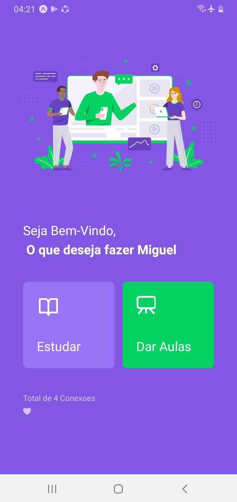
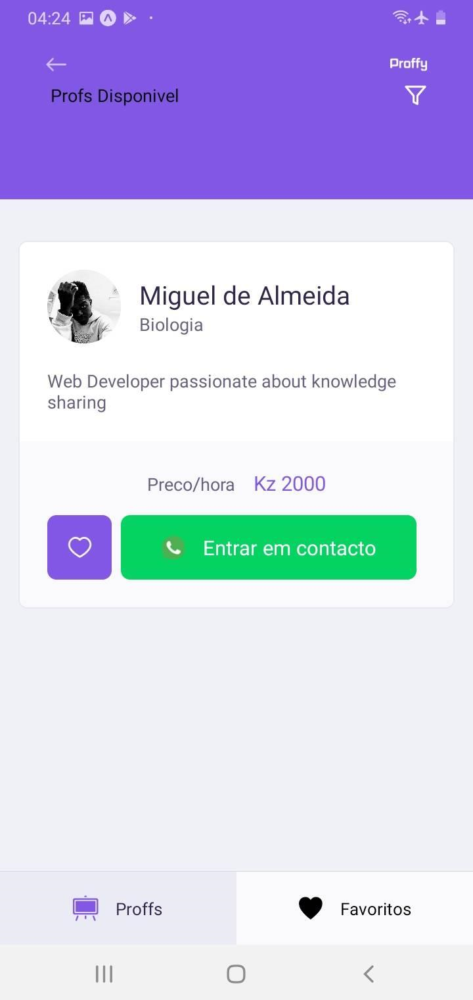
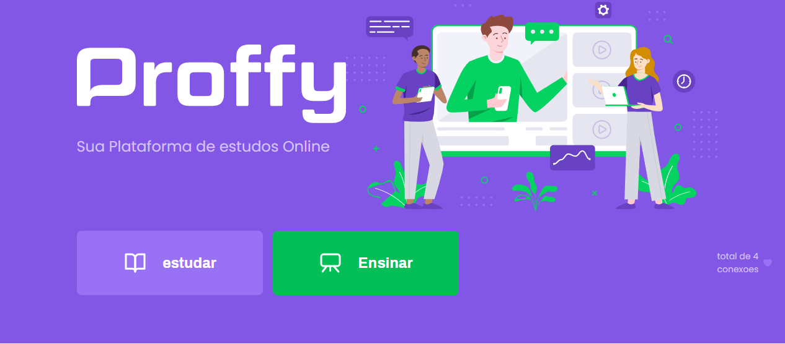

# NWL-RocketseatTrainning

<h1 align="center">
     ♻️ <a href="#" alt="Profy"> Proffy </a>
</h1>
  
Na semana de 3 à 9 aconteceu o evento da Rocketseat denominada NWL onde em uma semana é ensinado conteudo exclusivo e intenso sobre uma Stack.
nesta semana foi React, React Native e Nodejs com typeScript. foi uma explosão de conteuno intenso e este é o produto final do evento.

<h4 align="center">
	🚧   Versão 1 Concluído  🚀 🚧
</h4>

Tabela de conteúdos
=================
<!--ts-->
   * [Sobre o projeto](#-sobre-o-projeto)
   * [Funcionalidades](#-funcionalidades)
   * [Layout](#-layout)
     * [Mobile](#mobile)
     * [Web](#web)
   * [Como executar o projeto](#-como-executar-o-projeto)
     * [Pré-requisitos](#pré-requisitos)
     * [Rodando o Backend (servidor)](#user-content--rodando-o-backend-servidor)
     * [Rodando a aplicação web (Frontend)](#user-content--rodando-a-aplicação-web-frontend)
   * [Tecnologias](#-tecnologias)
     * [WebSite](#user-content-website--react----typescript)
     * [Server](#user-content-server--nodejs----typescript)
     * [Mobile](#user-content-mobile--react-native----typescript)
   * [Contribuidores](#-contribuidores)
   * [Como contribuir no projeto](#-como-contribuir-no-projeto)
   * [Autor](#-autor)
   * [Licença](#user-content--licença)
<!--te-->


## 💻 Sobre o projeto

Proffy - Neste tempo de confinamento o melhor é estudar apartir de casa. Usa o Proffy para encontrares os melhores Professores. Se es professor cadastre-se para seres encontrado. 
Projeto desenvolvido durante a **NLW - Next Level Week** oferecida pela [Rocketseat](https://blog.rocketseat.com.br/segunda-next-level-week/).
O NLW é uma experiência online com muito conteúdo prático, desafios e hacks onde o conteúdo fica disponível durante uma semana.

---

## ⚙️ Funcionalidades

- [x]Professores se cadastrando enviando:
  - [x] uma imagem para o Perfil
  - [x] Nome, disciplina que leciona, horarios disponiveis  
  - [x] whatsapp e o custo da aula


- [x] Os usuários tem acesso ao aplicativo móvel, e WebSite onde podem:
  - [x] Procurar professores com base na disciplina, dia da semana e hora (ou intervalo de horas no website)
  - [x] entrar em contato com o professor pelo WhatsApp
  - [x] Permite favoritar professores (somente na versao mobile)

---

## 🎨 Layout

### Mobile

<p align="center">
  
    
</p>

### Web

<p align="center" style="display: flex; align-items: flex-start; justify-content: center;">
  
</p>

---

## 🚀 Como executar o projeto

Este projeto é divido em três partes:
1. Backend (pasta server) 
2. Frontend (pasta web)
3. Mobile (pasta mobile)

💡Tanto o Frontend quanto o Mobile precisam que o Backend esteja sendo executado para funcionar.

### Pré-requisitos

Antes de começar, você vai precisar ter instalado em sua máquina as seguintes ferramentas:
[Git](https://git-scm.com), [Node.js](https://nodejs.org/en/). 
Além disto é bom ter um editor para trabalhar com o código como [VSCode](https://code.visualstudio.com/)
para toda informacao acesse <p><a href="https://www.notion.so/Instala-o-3d8bc65b8a0f48249bf3037156eb0a15">aqui</a></p>

#### 🎲 Rodando o Backend (servidor)

```bash

# Clone este repositório
$ git clone https://github.com/Guel-Almeida/NWL-RocketseatTrainning/

# Acesse a pasta do projeto no terminal/cmd
$ cd NWL-RocketseatTrainning

# Vá para a pasta server
$ cd server

# Instale as dependências
$ npm install

# Execute a aplicação em modo de desenvolvimento
$ npm run dev:server
```
ou 
```
$ yarn start

# O servidor inciará na porta:3333 - acesse http://localhost:3333 

```
<p align="center">
  
	usa o insomnia para testar a Api
</p>


#### 🧭 Rodando a aplicação web (Frontend)
<p>para saber sobre a configuração inteira de toda a bibliotecas <a href="https://www.notion.so/Instala-o-3d8bc65b8a0f48249bf3037156eb0a15">aqui</a></p>
```bash

# Clone este repositório se ainda não o fez
$ git clone https://github.com/Guel-Almeida/NWL-RocketseatTrainning/

# Acesse a pasta do projeto no seu terminal/cmd
$ cd NWL-RocketseatTrainning

# Vá para a pasta da aplicação Front End
$ cd web

# Instale as dependências
$ npm install

# Execute a aplicação em modo de desenvolvimento
$ npm run start
```
ou 
```
$ yarn start

# A aplicação será aberta na porta:3000 - acesse http://localhost:3000

```

---


#### 🧭 Rodando a aplicação Mobile 
<p>dpara saber sobre a configuração inteira de toda a bibliotecas <a href="https://www.notion.so/Instala-o-3d8bc65b8a0f48249bf3037156eb0a15">aqui</a></p>
```bash

# Clone este repositório se ainda não o fez
$ git clone https://github.com/Guel-Almeida/NWL-RocketseatTrainning/

# Acesse a pasta do projeto no seu terminal/cmd
$ cd NWL-RocketseatTrainning

# Vá para a pasta da aplicação Front End
$ cd mobile

# Instale as dependências
$ npm install

# Execute a aplicação em modo de desenvolvimento
$ npm run start
```
ou 
```
$ yarn start

# A aplicação será aberta na porta:3000 - acesse http://localhost:3000

```

---

## 🛠 Tecnologias

As seguintes ferramentas foram usadas na construção do projeto:

#### **Website**  ([React](https://reactjs.org/)  +  [TypeScript](https://www.typescriptlang.org/))

-   **[React Router Dom](https://github.com/ReactTraining/react-router/tree/master/packages/react-router-dom)**
-   **[React Icons](https://react-icons.github.io/react-icons/)**
-   **[Axios](https://github.com/axios/axios)**

> Veja o arquivo  [package.json](https://github.com/Guel-Almeida/NWL-RocketseatTrainning/
/blob/master/web/package.json)

#### **Server**  ([NodeJS](https://nodejs.org/en/)  +  [TypeScript](https://www.typescriptlang.org/))

-   **[Express](https://expressjs.com/)**
-   **[CORS](https://expressjs.com/en/resources/middleware/cors.html)**
-   **[KnexJS](http://knexjs.org/)**
-   **[SQLite](https://github.com/mapbox/node-sqlite3)**
-   **[ts-node](https://github.com/TypeStrong/ts-node)**

> Veja o arquivo  [package.json](https://github.com/Guel-Almeida/NWL-RocketseatTrainning/
/blob/master/server/package.json)

#### **Mobile**  ([React Native](http://www.reactnative.com/)  +  [TypeScript](https://www.typescriptlang.org/))

-   **[Expo](https://expo.io/)**
-   **[Expo Google Fonts](https://github.com/expo/google-fonts)**
-   **[React Navigation](https://reactnavigation.org/)**
-   **[Axios](https://github.com/axios/axios)**
-   **[Expo Location](https://docs.expo.io/versions/latest/sdk/location/)**


## 👨‍💻 Contribuidores

💜 Grato Sensei👏 foi ele quem nos guiou nesta jornada incrivel de conhecimento.

<table>
  <tr>
    <td align="center"><a href="https://rocketseat.com.br"><br /><sub><b>Diego Fernandes</b></sub></a><br />
  </tr>
  
</table>

## 💪 Como contribuir no projeto

1. Faça um **fork** do projeto.
2. Crie uma nova branch com as suas alterações: `git checkout -b my-feature`
3. Salve as alterações e crie uma mensagem de commit contando o que você fez: `git commit -m "feature: My new feature"`
4. Envie as suas alterações: `git push origin my-feature`
> Caso tenha alguma dúvida confira este

---

## 🦸 Autor


 
 <br />
 <sub><b>Miguel Almeida</b></sub></a>🚀


Feito No Treinamento da <a href="https://blog.rocketseat.com.br" title="Rocketseat">Rocketseat</a> 👋🏽 

[](https://www.linkedin.com/in/guel-almeida-2217271ab/) 
[](mailto:guelgaietaalmeida@gmail.com)
